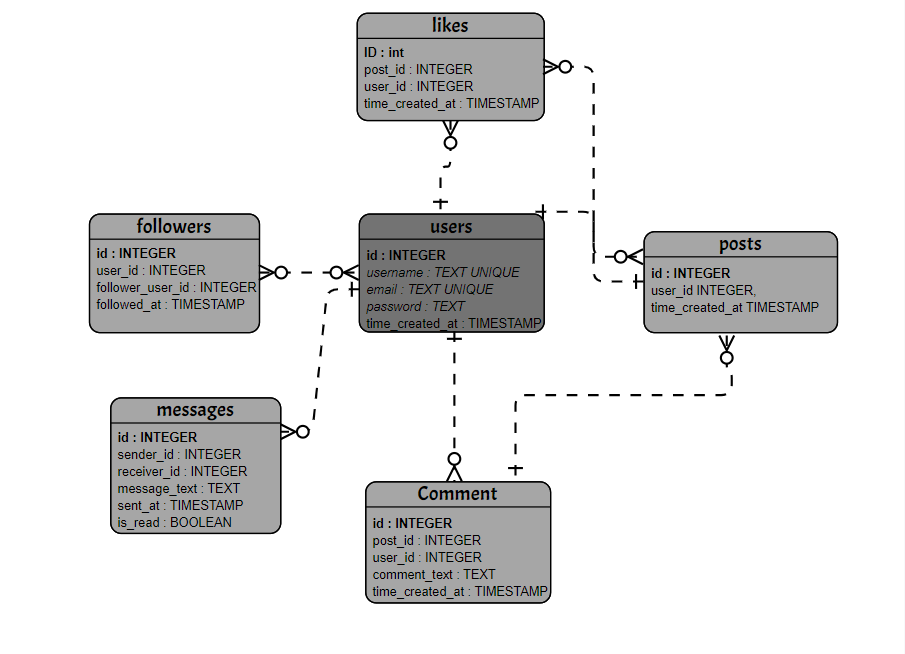

# Social Media Platform

## Scope

* **Purpose of the Database**:
  The database serves as the backend for a social media platform, facilitating user interactions, content creation, and engagement through posts, comments, likes, and messaging.

* **Entities Included**:
  - Users
  - Posts
  - Comments
  - Likes
  - Followers
  - Messages

## Functional Requirements

* **User Capabilities**:
  - Create an account and log in.
  - Post content, comment on posts, like posts, and send messages.
  - Follow and unfollow other users.
  - View user profiles, including follower and post counts.

## Representation

### Entities

* **Users**:
  - **Attributes**:
    - `id`: INTEGER
    - `username`: TEXT (Unique, Not Null)
    - `email`: TEXT (Unique, Not Null)
    - `password`: TEXT (Not Null)
    - `time_created_at`: TIMESTAMP (Default: CURRENT_TIMESTAMP)

* **Posts**:
  - **Attributes**:
    - `id`: INTEGER
    - `user_id`: INTEGER (Foreign Key)
    - `time_created_at`: TIMESTAMP (Default: CURRENT_TIMESTAMP)

* **Comments**:
  - **Attributes**:
    - `id`: INTEGER
    - `post_id`: INTEGER (Foreign Key)
    - `user_id`: INTEGER (Foreign Key)
    - `comment_text`: TEXT
    - `time_created_at`: TIMESTAMP (Default: CURRENT_TIMESTAMP)

* **Likes**:
  - **Attributes**:
    - `id`: INTEGER
    - `post_id`: INTEGER (Foreign Key)
    - `user_id`: INTEGER (Foreign Key)
    - `time_created_at`: TIMESTAMP (Default: CURRENT_TIMESTAMP)

* **Followers**:
  - **Attributes**:
    - `id`: INTEGER
    - `user_id`: INTEGER (Foreign Key)
    - `followed_at`: TIMESTAMP (Default: CURRENT_TIMESTAMP)

* **Messages**:
  - **Attributes**:
    - `id`: INTEGER
    - `sender_id`: INTEGER (Foreign Key)
    - `receiver_id`: INTEGER (Foreign Key)
    - `message_text`: TEXT (Not Null)
    - `sent_at`: TIMESTAMP (Default: CURRENT_TIMESTAMP)
    - `is_read`: BOOLEAN (Default: FALSE)

### Relationships

* **Users** can create multiple **Posts**.
* Each **Post** can have multiple **Comments** and **Likes**.
* **Users** can follow other **Users**.
* **Messages** are exchanged between **Users**.
